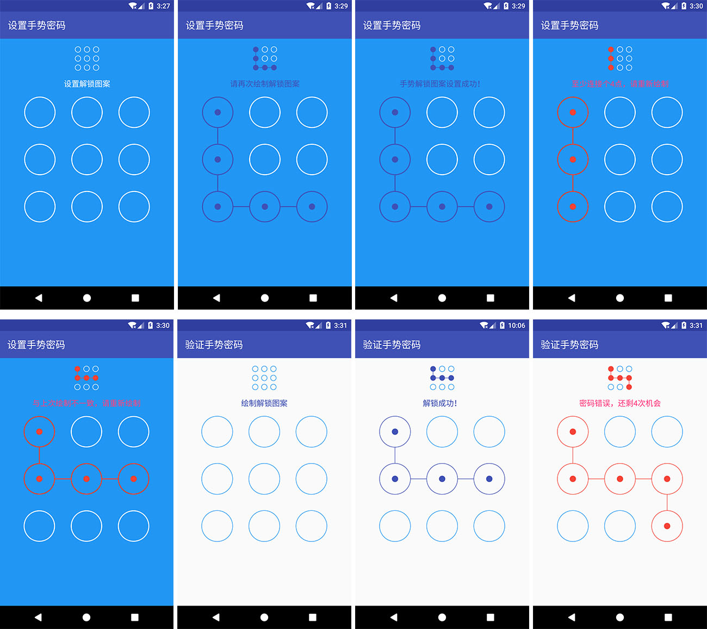

##  Pattern Locker

此为Android App中常用控件之一的图案解锁（手势解锁、手势密码、九宫格密码、九宫格图形锁等）控件开源库，PatternLockerView为主控件，负责图案密码的设置和验证，PatternIndicatorView为指示器辅助控件，可根据设计需要选择使用。

由于本人水平有限，如果您在使用的过程中发现bug，或者发现有更好的实现方式和代码中写得不足的地方，请提issue或者PR，本人万分感激！！！

## 效果图



## 使用方法

[](https://jitpack.io/#ihsg/PatternLocker)

第一步: 首先打开项目根目录下的 build.gradle，添加jitpack仓库地址，代码如下：
````
allprojects {
    repositories {
        jcenter()
        maven { url "https://jitpack.io" }
    }
}
````

第二步: 打开需要依赖此 library 的module，比如此demo中是 app 这个 module，添加：
````
dependencies {
    ....
    compile 'com.github.ihsg:PatternLock:2.0.0'
}
````

第三步: 在布局文件中添加PatternLockViewer和PatternIndicatorView（可根据设计需要选择使用）控件，示意如下：

````
<?xml version="1.0" encoding="utf-8"?>
<LinearLayout xmlns:android="http://schemas.android.com/apk/res/android"
    xmlns:app="http://schemas.android.com/apk/res-auto"
    android:layout_width="match_parent"
    android:layout_height="match_parent"
    android:background="@color/colorWhite"
    android:orientation="vertical">        
    
    ......    
    
    <com.github.ihsg.patternlocker.PatternIndicatorView
        android:id="@+id/pattern_indicator_view"
        android:layout_width="50dp"
        android:layout_height="50dp"
        android:layout_gravity="center"
        android:layout_margin="20dp" />

    <com.github.ihsg.patternlocker.PatternLockerView
        android:id="@+id/pattern_lock_view"
        android:layout_width="match_parent"
        android:layout_height="match_parent"
        android:layout_marginLeft="50dp"
        android:layout_marginRight="50dp"
        android:layout_marginTop="20dp" />
</LinearLayout>

````
第四步: 在java代码中为PatternLockerView添加OnPatternChangeListener并处理相应业务逻辑，OnPatternChangeListener接口说明如下：
````
public interface OnPatternChangeListener {
    /**
     * 开始绘制图案时（即手指按下触碰到绘画区域时）会调用该方法
     *
     * @param view
     */
    void onStart(PatternLockerView view);

    /**
     * 图案绘制改变时（即手指在绘画区域移动时）会调用该方法，请注意只有 @param hitList改变了才会触发此方法
     *
     * @param view
     * @param hitList
     */
    void onChange(PatternLockerView view, List<Integer> hitList);

    /**
     * 图案绘制完成时（即手指抬起离开绘画区域时）会调用该方法
     *
     * @param view
     * @param hitList
     */
    void onComplete(PatternLockerView view, List<Integer> hitList);

    /**
     * 已绘制的图案被清除时会调用该方法
     *
     * @param view
     */
    void onClear(PatternLockerView view);
}
````
## 自由定制

### 1. 简单定制   
可以通过xml和java代码两种方式更改默认颜色、绘制时颜色、出错时颜色、填充色以及连接线粗细

> 推荐使用xml方式，更精简，更方便

#### 1.1 xml方式
- PatternLockerView可设置的属性

| 属性名            | 说明         | 默认值     |
| :------------- | :--------- | :------ |
| plv_color      | 默认图案的颜色    | #2196F3 |
| plv_hitColor   | 绘制图案的颜色    | #3F51B5 |
| plv_errorColor | 绘制图案出错时的颜色 | #F44336 |
| plv_fillColor  | 图案填充色      | #FFFFFF |
| plv_lineWidth  | 连接线线宽      | 1dp     |

示例如下：
```
<com.github.ihsg.patternlocker.PatternLockerView
        android:id="@+id/pattern_lock_view"
        android:layout_width="match_parent"
        android:layout_height="match_parent"
        android:layout_marginLeft="50dp"
        android:layout_marginRight="50dp"
        android:layout_marginTop="20dp"
        app:plv_color="@color/colorWhite"
        app:plv_hitColor="@color/colorPrimaryDark"
        app:plv_fillColor="@color/color_blue"
        app:plv_errorColor="@color/color_red"
        app:plv_lineWidth="3dp"/>
```

- PatternIndicatorView可设置的属性

| 属性名            | 说明             | 默认值     |
| :------------- | :------------- | :------ |
| piv_color      | 指示器默认图案的颜色     | #2196F3 |
| piv_hitColor   | 指示器中选中图案的颜色    | #3F51B5 |
| piv_errorColor | 指示器中选中图案出错时的颜色 | #F44336 |
| piv_fillColor  | 图案填充色          | #FFFFFF |
| piv_lineWidth  | 指示器连接线线宽       | 1dp     |

示例如下：
```
<com.github.ihsg.patternlocker.PatternIndicatorView
        android:id="@+id/pattern_indicator_view"
        android:layout_width="50dp"
        android:layout_height="50dp"
        android:layout_gravity="center"
        android:layout_margin="20dp"
        app:piv_color="@color/colorWhite"
        app:piv_hitColor="@color/colorPrimaryDark"
        app:piv_fillColor="@color/color_blue"
        app:piv_errorColor="@color/color_red"
        app:plv_lineWidth="2dp"/>
```
#### 1.2 java代码方式

> 注意：设置完一定要调用buildWithDefaultStyle()方法使各个设置生效！！！

- PatternLockerView可设置的属性
````
this.patternLockerView.setFillColor(getResources().getColor(R.color.color_blue))
                .setNormalColor(getResources().getColor(R.color.colorWhite))
                .setHitColor(getResources().getColor(R.color.colorPrimaryDark))
                .setErrorColor(getResources().getColor(R.color.color_red))
                .setLineWidth(TypedValue.applyDimension(TypedValue.COMPLEX_UNIT_DIP, 5f,
                        getResources().getDisplayMetrics()))
                .buildWithDefaultStyle();
````

- PatternIndicatorView可设置的属性
````
this.patternIndicatorView.setFillColor(getResources().getColor(R.color.color_blue))
                .setNormalColor(getResources().getColor(R.color.colorWhite))
                .setHitColor(getResources().getColor(R.color.colorPrimaryDark))
                .setErrorColor(getResources().getColor(R.color.color_red))
                .setLineWidth(TypedValue.applyDimension(TypedValue.COMPLEX_UNIT_DIP, 2f,
                        getResources().getDisplayMetrics()))
                .buildWithDefaultStyle();
````

### 2. 深度定制

PatternLockerView和PatternIndicatorView均提供了设置连接线、各个小单元控件在不同状态下（正常、设置以及出错）的绘制方式的方法，只需要实现如下几个接口即可，从而可以根据设计需求高度自由定制。

- 正常状态下各个小单元控件的样式（PatternLockerView和PatternIndicatorView通用）

```
public interface INormalCellView {
    /**
     * 绘制正常情况下（即未设置的）每个图案的样式
     *
     * @param canvas
     * @param cellBean the target cell view
     */
    void draw(@NonNull Canvas canvas, @NonNull CellBean cellBean);
}
```

- 设置时各个小单元控件的样式（PatternLockerView和PatternIndicatorView通用）

```
public interface IHitCellView {
    /**
     * 绘制已设置的每个图案的样式
     *
     * @param canvas
     * @param cellBean
     * @param isError
     */
    void draw(@NonNull Canvas canvas, @NonNull CellBean cellBean, boolean isError);
}
```

- PatternLockerView连接线的样式

  ```
  public interface ILockerLinkedLineView {
      /**
       * 绘制图案密码连接线
       *
       * @param canvas
       * @param hitList
       * @param cellBeanList
       * @param endX
       * @param endY
       * @param isError
       */
      void draw(@NonNull Canvas canvas,
                @Nullable List<Integer> hitList,
                @NonNull List<CellBean> cellBeanList,
                float endX,
                float endY,
                boolean isError);
  }
  ```

- PatternIndicatorView连接线的样式

```
public interface IIndicatorLinkedLineView {
    /**
     * 绘制指示器连接线
     *
     * @param canvas
     * @param hitList
     * @param cellBeanList
     * @param isError
     */
    void draw(@NonNull Canvas canvas,
              @Nullable List<Integer> hitList,
              @NonNull List<CellBean> cellBeanList,
              boolean isError);
}
```

> 温馨提示：
> 1、更详细的定制方式可参考demo中以及Library中default开头的代码；
> 2、如果设置了以上样式，最后需要通过build()方法使设置方法生效，详见代码。