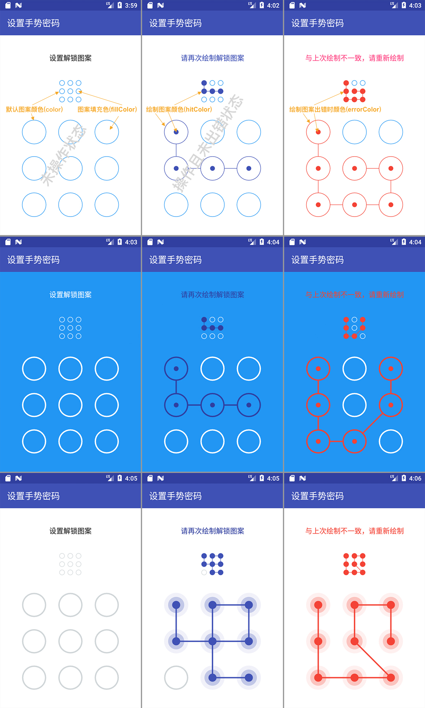

##  Pattern Locker

此为Android App中常用控件之一的图案解锁（手势解锁、手势密码、九宫格密码、九宫格图形锁等）控件开源库，PatternLockerView为主控件，负责图案密码的设置和验证，PatternIndicatorView为指示器辅助控件，可根据设计需要选择使用。

由于本人水平有限，如果您在使用的过程中发现bug，或者发现有更好的实现方式和代码中写得不足的地方，请提issue或者PR，本人万分感激！！！

## 功能介绍
- 支持自定义各状态下（未操作时、操作时以及操作出错时）线颜色、填充色和线宽；
- 支持自定义各种状态下（未操作时、操作时以及操作出错时）每个CellView样式和连接线样式；
- 支持图案绘制完成后延迟1秒（默认值）自动清除；
- 支持是否跳过中间点（默认不跳过）；
- 支持是否触碰震动反馈（默认不震动）；
- 支持指示器辅助控件可选择使用；
- 业务逻辑（至少连点几个点、验证时最多可出错几次等）必须自定义。

## 预览效果图


[点击下载PatternLockerDemo.apk](https://fir.im/qvhx) 或者扫描下方二维码下载安装   


## 使用方法

[](https://jitpack.io/#ihsg/PatternLocker)

第一步: 首先打开项目根目录下的 build.gradle，添加jitpack仓库地址，代码如下：
````
allprojects {
    repositories {
        ...
        maven { url "https://jitpack.io" }
    }
}
````

第二步: 打开需要依赖此 library 的module，比如此demo中是 app 这个 module，添加：
````
dependencies {
    ....
    implementation 'com.github.ihsg:PatternLocker:2.4.5'
}
````

第三步: 在布局文件中添加PatternLockViewer和PatternIndicatorView（可根据设计需要选择使用）控件，示意如下：

````
<?xml version="1.0" encoding="utf-8"?>
<LinearLayout xmlns:android="http://schemas.android.com/apk/res/android"
    xmlns:app="http://schemas.android.com/apk/res-auto"
    android:layout_width="match_parent"
    android:layout_height="match_parent"
    android:background="@color/colorWhite"
    android:orientation="vertical">        
    
    ......    
    
    <com.github.ihsg.patternlocker.PatternIndicatorView
        android:id="@+id/pattern_indicator_view"
        android:layout_width="50dp"
        android:layout_height="50dp"
        android:layout_gravity="center"
        android:layout_margin="20dp" />

    <com.github.ihsg.patternlocker.PatternLockerView
        android:id="@+id/pattern_lock_view"
        android:layout_width="match_parent"
        android:layout_height="match_parent"
        android:layout_marginLeft="50dp"
        android:layout_marginRight="50dp"
        android:layout_marginTop="20dp" />
</LinearLayout>

````
第四步: 在java代码中为PatternLockerView添加OnPatternChangeListener并处理相应业务逻辑，OnPatternChangeListener接口说明如下：
````
interface OnPatternChangeListener {
    /**
     * 开始绘制图案时（即手指按下触碰到绘画区域时）会调用该方法
     *
     * @param view
     */
    fun onStart(view: PatternLockerView)

    /**
     * 图案绘制改变时（即手指在绘画区域移动时）会调用该方法，请注意只有 @param hitList改变了才会触发此方法
     *
     * @param view
     * @param hitIndexList
     */
    fun onChange(view: PatternLockerView, hitIndexList: List<Int>)

    /**
     * 图案绘制完成时（即手指抬起离开绘画区域时）会调用该方法
     *
     * @param view
     * @param hitIndexList
     */
    fun onComplete(view: PatternLockerView, hitIndexList: List<Int>)

    /**
     * 已绘制的图案被清除时会调用该方法
     *
     * @param view
     */
    fun onClear(view: PatternLockerView)
}
````
##  已知问题解决方案

####  1. Java开发使用该库出现的错误: Didn't find class "kotlin.reflect.KProperty"

解决方案：请配置kotlin开发环境 [参考Kotlin官网](https://kotlinlang.org/docs/tutorials/kotlin-android.html)

步骤1: 在根目录下的buid.gradle

```
buildscript {
    ext {
        kotlinVersion = '1.3.11'
    }
    dependencies {
        ......
        classpath "org.jetbrains.kotlin:kotlin-gradle-plugin:$kotlinVersion"
        
        // NOTE: Do not place your application dependencies here; they belong
        // in the individual module build.gradle files
    }
}
```

步骤2: 在module目录下的buid.gradle

```
apply plugin: 'com.android.application'
apply plugin: 'kotlin-android'

dependencies {
    ......
    implementation "org.jetbrains.kotlin:kotlin-stdlib-jdk7:$kotlinVersion"
}

```


## 自由定制

### 1. 简单定制   
可以通过xml和java代码两种方式更改默认颜色、绘制时颜色、出错时颜色、填充色以及连接线粗细

> 推荐使用xml方式，更精简，更方便

#### 1.1 xml方式
- PatternLockerView可设置的属性

| 属性名            | 说明         | 默认值     |
| :------------- | :--------: | :-----: |
| plv_color      | 默认图案的颜色    | #2196F3 |
| plv_hitColor   | 绘制图案的颜色    | #3F51B5 |
| plv_errorColor | 绘制图案出错时的颜色 | #F44336 |
| plv_fillColor  | 图案填充色      | #FFFFFF |
| plv_lineWidth  | 连接线线宽      | 1dp     |
| plv_enableAutoClean  | 自动清除绘制图案      | true     |
| plv_canSkip              |    是否跳过中间点    |  false  |
| plv_enableHapticFeedback | 是否使用触碰震动反馈 |  false  |
| plv_freezeDuration | 操作完延时清除时长（单位ms） | 1000 |


示例如下：
```
<com.github.ihsg.patternlocker.PatternLockerView
        android:id="@+id/patternLockerView"
        android:layout_width="match_parent"
        android:layout_height="match_parent"
        android:layout_marginLeft="50dp"
        android:layout_marginTop="20dp"
        android:layout_marginRight="50dp"
        app:plv_canSkip="true"
        app:plv_color="@color/color_gray"
        app:plv_enableAutoClean="false"
        app:plv_errorColor="@color/color_red"
        app:plv_fillColor="@color/colorWhite"
        app:plv_hitColor="@color/colorPrimary"
        app:plv_freezeDuration="5000"
        app:plv_lineWidth="3dp" />
```

- PatternIndicatorView可设置的属性

| 属性名            | 说明             | 默认值     |
| :------------- | :------------- | :------ |
| piv_color      | 指示器默认图案的颜色     | #2196F3 |
| piv_hitColor   | 指示器中选中图案的颜色    | #3F51B5 |
| piv_errorColor | 指示器中选中图案出错时的颜色 | #F44336 |
| piv_fillColor  | 图案填充色          | #FFFFFF |
| piv_lineWidth  | 指示器连接线线宽       | 1dp     |

示例如下：
```
<com.github.ihsg.patternlocker.PatternLockerView
        android:id="@+id/patternLockerView"
        android:layout_width="match_parent"
        android:layout_height="match_parent"
        android:layout_marginLeft="50dp"
        android:layout_marginTop="20dp"
        android:layout_marginRight="50dp"
        app:plv_canSkip="true"
        app:plv_enableHapticFeedback="true"
        app:plv_color="@color/color_gray"
        app:plv_enableAutoClean="false"
        app:plv_errorColor="@color/color_red"
        app:plv_fillColor="@color/colorWhite"
        app:plv_hitColor="@color/colorPrimary"
        app:plv_lineWidth="3dp" />
```
#### 1.2 java代码方式

> 注意：设置完一定要调用buildWithDefaultStyle()方法使各个设置生效！！！

- PatternLockerView可设置的属性
````
this.patternLockerView.setFillColor(getResources().getColor(R.color.color_blue))
                .setNormalColor(getResources().getColor(R.color.colorWhite))
                .setHitColor(getResources().getColor(R.color.colorPrimaryDark))
                .setErrorColor(getResources().getColor(R.color.color_red))
                .setLineWidth(TypedValue.applyDimension(TypedValue.COMPLEX_UNIT_DIP, 5f,
                        getResources().getDisplayMetrics()))
                .buildWithDefaultStyle();
````

- PatternIndicatorView可设置的属性
````
this.patternIndicatorView.setFillColor(getResources().getColor(R.color.color_blue))
                .setNormalColor(getResources().getColor(R.color.colorWhite))
                .setHitColor(getResources().getColor(R.color.colorPrimaryDark))
                .setErrorColor(getResources().getColor(R.color.color_red))
                .setLineWidth(TypedValue.applyDimension(TypedValue.COMPLEX_UNIT_DIP, 2f,
                        getResources().getDisplayMetrics()))
                .buildWithDefaultStyle();
````

### 2. 深度定制

PatternLockerView和PatternIndicatorView均提供了设置连接线、各个小单元控件在不同状态下（正常、设置以及出错）的绘制方式的方法，只需要实现如下几个接口即可，从而可以根据设计需求高度自由定制。

- 正常状态下各个小单元控件的样式（PatternLockerView和PatternIndicatorView通用）

```
interface INormalCellView {
    /**
     * 绘制正常情况下（即未设置的）每个图案的样式
     *
     * @param canvas
     * @param cellBean the target cell view
     */
    fun draw(canvas: Canvas, cellBean: CellBean)
}
```

- 设置时各个小单元控件的样式（PatternLockerView和PatternIndicatorView通用）

```
interface IHitCellView {
    /**
     * 绘制已设置的每个图案的样式
     *
     * @param canvas
     * @param cellBean
     * @param isError
     */
    fun draw(canvas: Canvas, cellBean: CellBean, isError: Boolean)
}
```

- PatternLockerView连接线的样式

```
interface ILockerLinkedLineView {
    /**
     * 绘制图案密码连接线
     *
     * @param canvas
     * @param hitIndexList
     * @param cellBeanList
     * @param endX
     * @param endY
     * @param isError
     */
    fun draw(canvas: Canvas,
             hitIndexList: List<Int>,
             cellBeanList: List<CellBean>,
             endX: Float,
             endY: Float,
             isError: Boolean)
}
```

- PatternIndicatorView连接线的样式

```
interface IIndicatorLinkedLineView {
    /**
     * 绘制指示器连接线
     *
     * @param canvas
     * @param hitIndexList
     * @param cellBeanList
     * @param isError
     */
    fun draw(canvas: Canvas,
             hitIndexList: List<Int>,
             cellBeanList: List<CellBean>,
             isError: Boolean)
}
```

> 温馨提示：       
> 1、更详细的定制方式可参考demo中以及Library中default开头的代码；               
> 2、如果设置了以上样式，最后需要通过build()方法使设置方法生效，详见代码。

